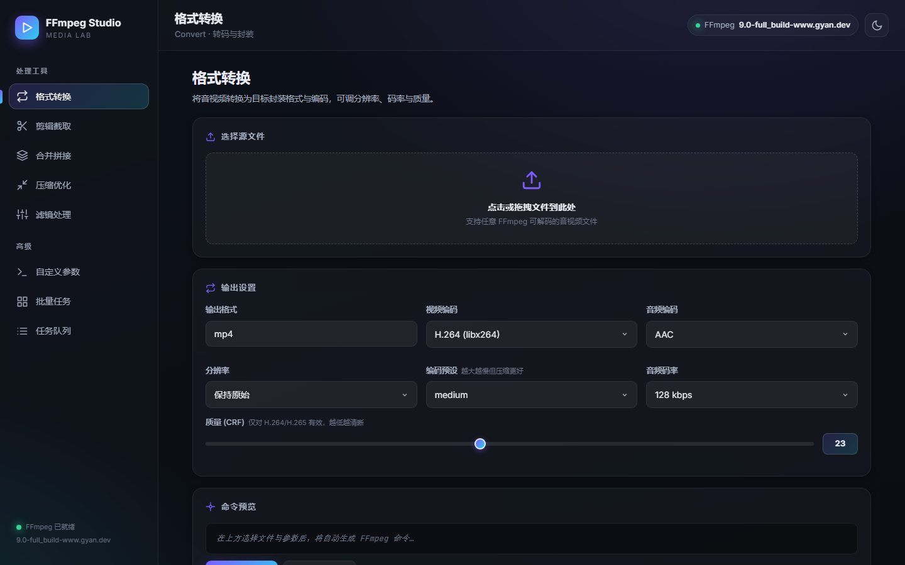
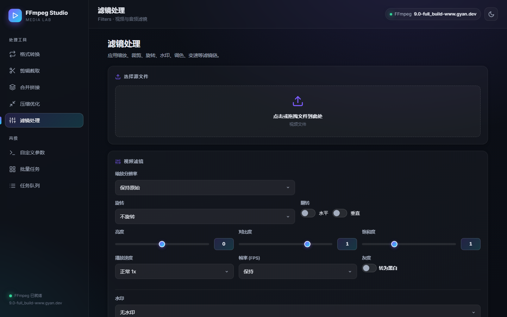
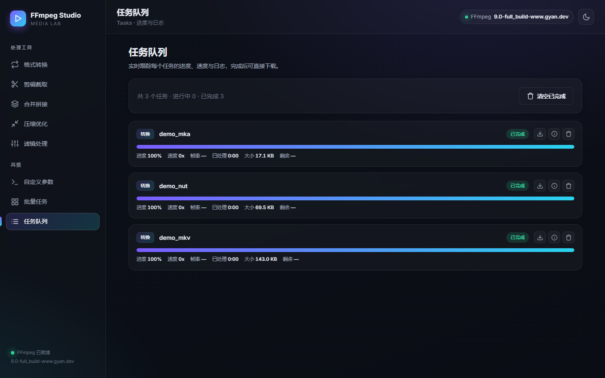

# FFmpeg Studio

音视频处理工作台 —— 跑在本机浏览器里的 FFmpeg 图形前端。上传文件、调参数、看实时进度，不用记命令行。

后端是一个本地 FastAPI 服务，浏览器打开 `http://127.0.0.1:8787` 即用。**所有处理都在本机完成，文件不出网。**

## 功能

六种处理模式：

| 模式 | 说明 |
| --- | --- |
| **格式转换** | 转封装 / 转码，可选视频编码、音频编码、分辨率、CRF、编码预设 |
| **剪辑截取** | 按开始时间 + 结束时间/时长截取，支持流复制（无损极速）或重新编码 |
| **合并拼接** | 多片段合并为一个文件，支持拖拽排序 |
| **压缩优化** | 调 CRF / 分辨率 / 音频码率减小体积；支持两遍编码逼近目标文件大小 |
| **滤镜处理** | 缩放、裁剪、旋转、翻转、亮度/对比度/饱和度、变速、帧率、灰度、文字水印、图片水印 |
| **自定义参数** | 直接填 ffmpeg 额外参数，走完整 argv |

**输出格式不设限**：格式框可以自由输入，ffmpeg 支持什么就能填什么 —— `mxf`（广播级）、`nut`、`mka`、`y4m`、`avif`、`rawvideo` 都能直接用。下拉列表只是常用项的快捷提示，**不是可选范围**。

其他特性：

- **命令预览**：参数一改，实时生成等价的 ffmpeg 命令。预览用的命令构造器和实际执行**是同一个函数**（`build_command`），所以看到的命令就是真正会跑的命令。
- **批量任务队列** + SSE 实时进度与日志
- 拖拽上传
- 单文件 exe，免装 Python

## 截图







## 下载

到 [Releases](../../releases) 页面下载：

- `FFmpegStudio.exe` —— 单文件可执行程序，双击即用。可与 `start.bat` 放同一目录，双击 `start.bat` 会自动打开浏览器。
- `FFmpegStudio_Setup.exe` —— Inno Setup 安装包，安装到 `Program Files`（需要管理员权限）。

## ffmpeg 依赖

程序**不含** ffmpeg，启动时自动探测，顺序为：

1. `PATH` 里的 `ffmpeg` / `ffprobe`
2. 程序同目录下的 `ffmpeg.exe` / `ffprobe.exe`
3. 程序同目录 `bin/` 下的
4. winget 安装的 shim（`%LOCALAPPDATA%\Microsoft\WinGet\Links`）

推荐用 winget 装一份全功能构建：

```powershell
winget install Gyan.FFmpeg
```

或者把 `ffmpeg.exe` / `ffprobe.exe` 直接放到程序旁边，做成**完全便携版**，拷到任何电脑都能用。

## 从源码运行

需要 Python 3.10+：

```bash
pip install -r requirements.txt
python server/main.py
```

然后打开 <http://127.0.0.1:8787>。

## 环境变量

| 变量 | 默认值 | 说明 |
| --- | --- | --- |
| `FFSTUDIO_HOST` | `127.0.0.1` | 监听地址。**服务无鉴权**，默认只允许本机访问；改成 `0.0.0.0` 才能被局域网访问（有风险） |
| `FFSTUDIO_PORT` | `8787` | 监听端口 |

## 源码结构

| 路径 | 说明 |
| --- | --- |
| `server/main.py` | FastAPI 后端：命令构造、任务执行、SSE 进度推送 |
| `frontend/index.html` | 单页界面 |
| `frontend/js/` | `api` / `store` / `ui` / `modules` / `app` 五个模块 |
| `frontend/css/styles.css` | 样式 |
| `FFmpegStudio.spec` | PyInstaller 打包配置（onefile） |
| `setup.iss` | Inno Setup 安装脚本 |
| `start.bat` | 便携版启动脚本（起服务 + 开浏览器） |

## 自构建

单文件 exe：

```bash
pip install -r requirements.txt pyinstaller
pyinstaller --noconfirm FFmpegStudio.spec
```

产物在 `dist/FFmpegStudio.exe`。

安装包：用 Inno Setup 6+ 编译 `setup.iss`：

```bash
ISCC.exe setup.iss
```

产物在 `dist/FFmpegStudio_Setup.exe`。

## API

| 方法 | 路径 | 说明 |
| --- | --- | --- |
| GET | `/api/health` | 服务与 ffmpeg 状态 |
| POST | `/api/upload` | 上传文件 |
| POST | `/api/probe` | 探测媒体信息 |
| POST | `/api/preview` | 只生成命令，不执行 |
| POST | `/api/jobs` | 创建任务 |
| GET | `/api/jobs` | 任务列表 |
| GET | `/api/jobs/{id}` | 任务详情 |
| GET | `/api/jobs/{id}/stream` | SSE 实时进度 |
| POST | `/api/jobs/{id}/cancel` | 取消任务 |
| GET | `/api/download/{id}` | 下载产物 |
| DELETE | `/api/jobs/{id}` | 删除任务 |

## 说明

- 上传文件与输出保存在程序目录下的 `uploads/`、`outputs/`，不会提交到仓库。
- 服务无鉴权，默认仅监听本机回环地址，**切勿暴露到公网**。
- 调用 ffmpeg 一律使用 argv 列表（`subprocess`，不经 shell），自定义参数也经 `shlex.split`，避免命令注入。

## 许可

[MIT](LICENSE)
